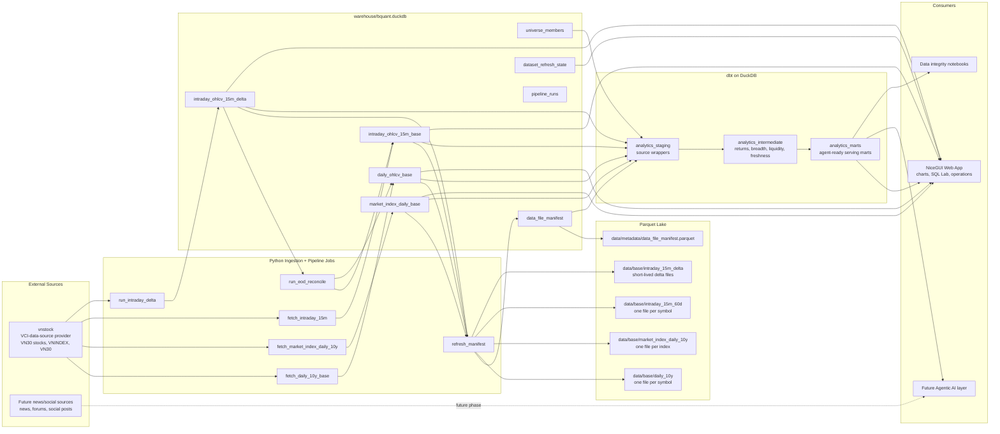
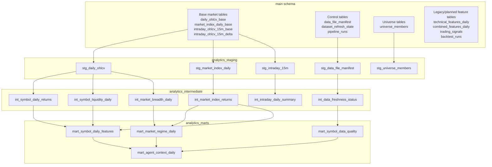
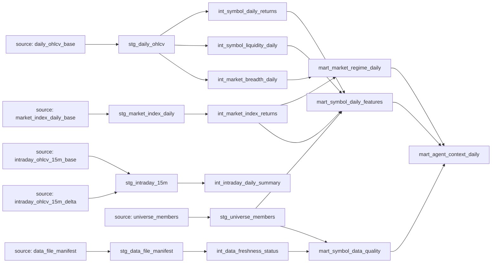
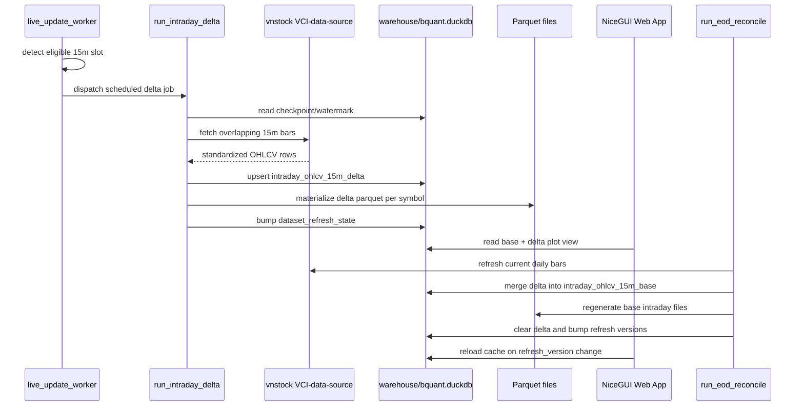
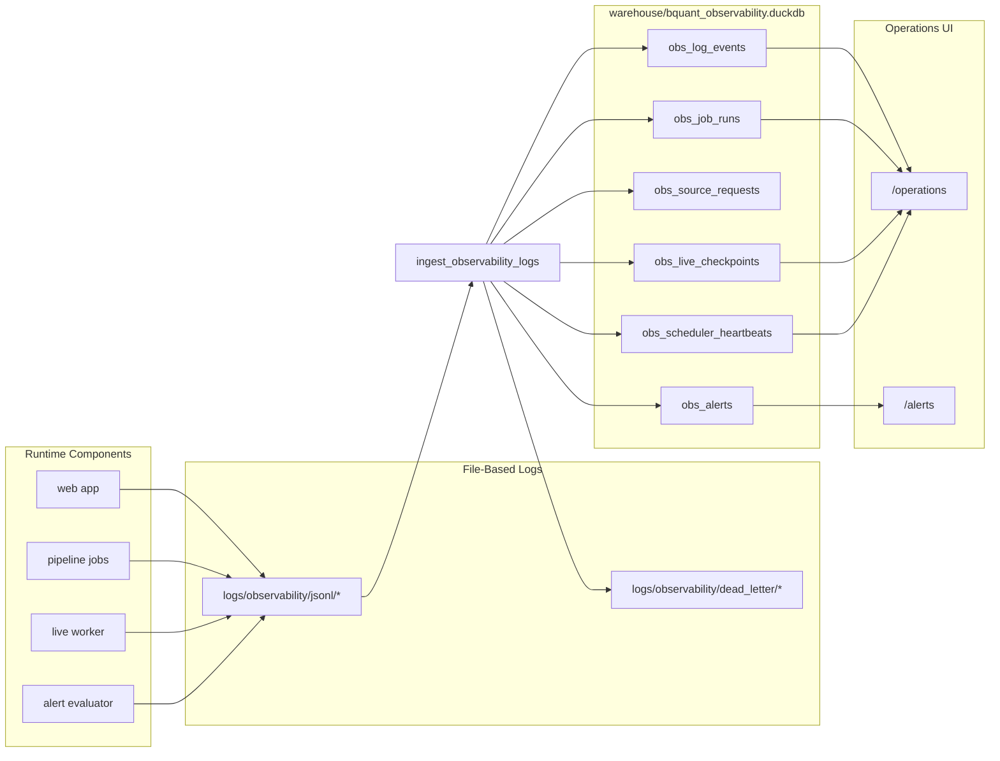
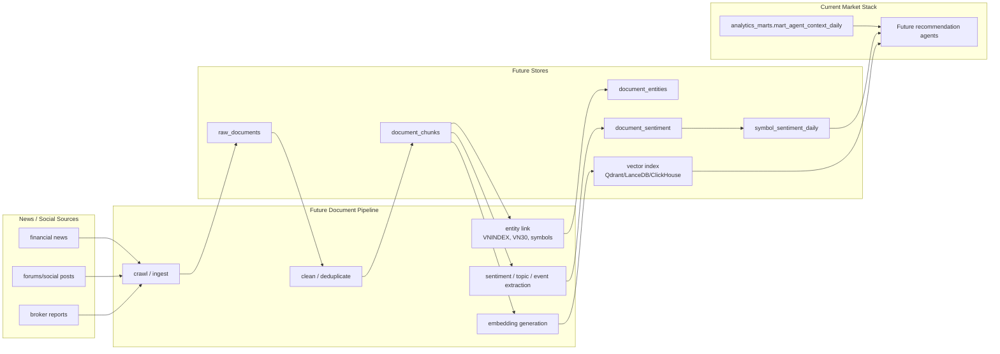

# BQuant Current Data System Diagram

Snapshot date: `2026-06-29`

This document visualizes the current BQuant data platform as implemented in the repository. It focuses on market data, live update state, dbt analytics marts, observability, and the future news/vector extension point.

Naming note: `VCI-data-source` is the human-facing provider label for the `vnstock` API source code `VCI`. It does not mean the stock symbol `VCI`; stock symbols are passed separately as values such as `VCB`, `FPT`, `VNINDEX`, or `VN30`.

## 1. End-to-End Data Flow

## 2. DuckDB Schemas And Responsibilities

## 3. dbt Model Lineage

Current dbt validation status:

| Layer | Count |
| --- | ---: |
| Models | `15` |
| Tests | `72` |
| Sources | `8` |
| Mart rows: `mart_market_regime_daily` | `2,499` |
| Mart rows: `mart_symbol_daily_features` | `69,674` |
| Mart rows: `mart_symbol_data_quality` | `30` |
| Mart rows: `mart_agent_context_daily` | `69,674` |

## 4. Live Update And EOD Merge Flow

## 5. Observability Data Flow

## 6. Future News And Vector Data Extension

This part is not implemented yet. It shows where the planned news/social vector dataset should attach without disrupting the current market-data stack.

Recommended implementation rule for the news/vector phase:

- keep raw document ingestion append-only
- treat embeddings as versioned derived data
- aggregate symbol/index sentiment into daily marts before joining with market features
- let future agents read `mart_agent_context_daily` plus sentiment/vector retrieval results, not raw crawler output directly
